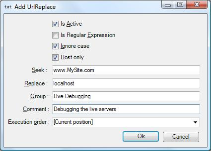

# Debugging Localhost Traffic

As a standard Fiddler doesn’t track localhost traffic. You can achieve  this in a number of ways using the www.somesite.com site or using 127.0.0.1. (Note the . in the end)
Instead you can do the following.

Replace www.MySite.com with your own site and you are up and running.
Please note that you get the cookies from your live server passed to your localhost too… nice
