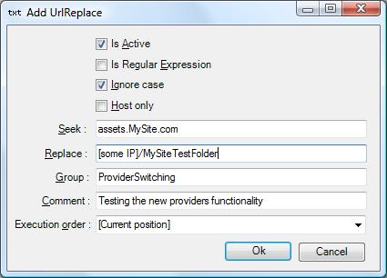
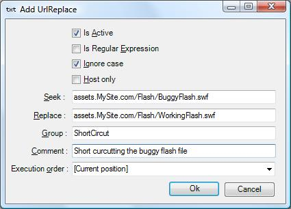
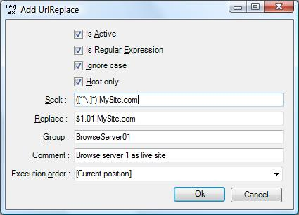

# Examples

**Switching asset providers**
At my company we are currently switching content provider from one 
major player to another… politics… For testing the switch we needed to 
‘simulate’ the switch for our QA staff. Instead of creating a completely 
separate environment or messing around with the hosts file, we used 
UrlReplace for changing the host. Something like this.

**Short circuit buggy flash file**
For a project I needed to maintain some code on a page which also 
contained a flash causing the browser to crash (even Chrome and Firefox). 
While our Flash guru was working on the flash and needed to access 
the page I also needed to test my code so I used UrlReplace to replace 
the buggy flash file for a completely different flash. Something like this.

**Environment shifting**
When working with a site containing many subsites with many codependences 
you often end up in a situation where links between sites are not as easily 
maintained as you’d normally hope for. In this situation I needed to navigate 
my entire site on one specific server but all links on the pages were still 
referring to the url’s picked up by our loadbalancer causing me to flip flop 
between servers. All our servers are setup with a * alias in the dns allowing 
me to address a specific server something like this www.01.mysite.com. 
This allowed me to browse the entire site on the one server by doing 
something like this. 

See also the examples in [Debugging Localhost Traffic](Debugging-Localhost-Traffic) and [Debugging Webservices](webservices)