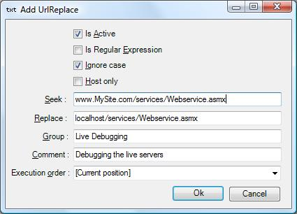

# Debugging Webservices

When debugging webservices you usually run into the problem of having to run the entire site locally and if you have hardcoded flash files or ajax even this might not make it work. 
Instead you can do the following.
